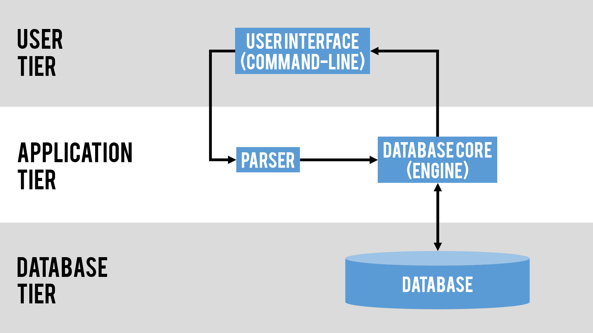
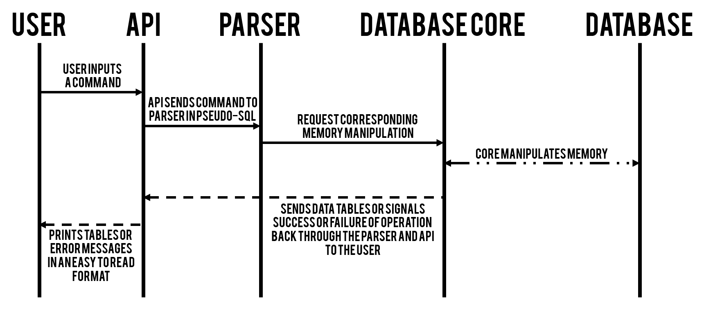
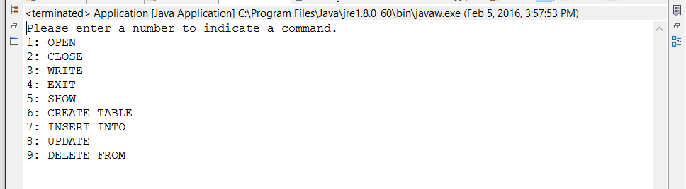
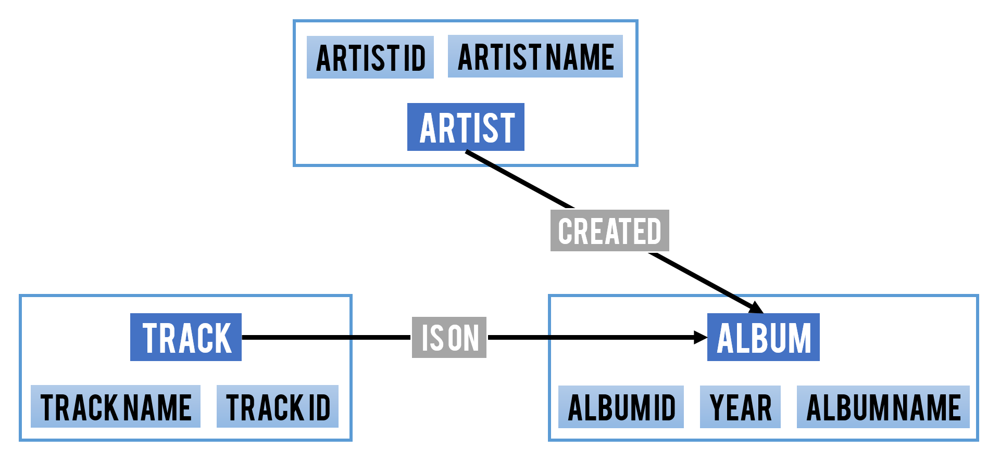
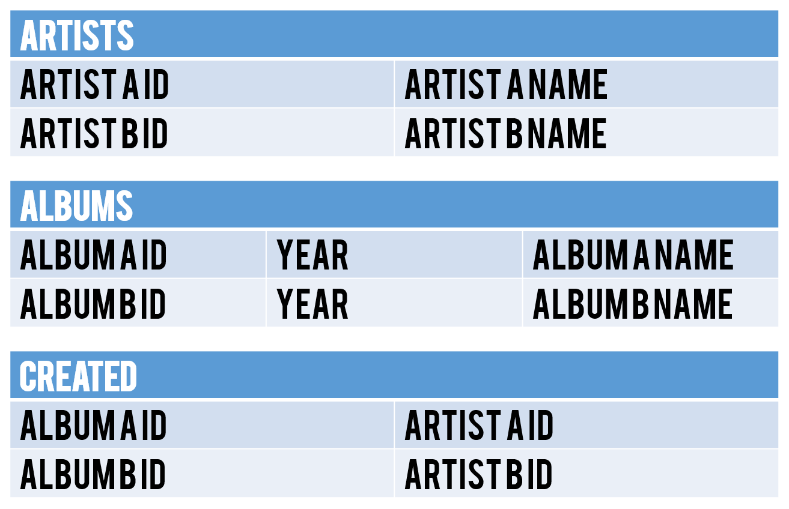

# Design Document

CSCE 315-502. Kyle Purser, Jessica Fang, Reid Shultz, Rishabh Prasad.

## Purpose.

This assignment consists of two major parts: generic relational database management system (RDBMS) based on relational algebra and application that will use our RDBMS. 

The RDBMS will consist of a generic parser and an engine. The parser will receive pseudo-SQL commands from an application for interpretation. The parser should be able to interpret commands from any application that can give pseudo-SQL. The interpretation is communicated with the engine, which then calls the corresponding data manipulation. Manipulations the engine should be able to add, delete, and update data within the database as well as retrieve data tables to send back to the API.

A database application will be created to demonstrate the functionality of our RDBMS system. The application we will be creating is a music database. The user will be able to store artists, albums, and tracks, as well as the relationships between artists and albums and albums to tracks. This type of database application could potentially be used for the back end of a music streaming site or personal music library and appeals to music companies, professionals, as well as recreational listeners.

## High-Level Entities.

There are four major entities in this assignment: a database, an engine, a parser, and an API (database application).

> the four major entities.

#### API (Application). 	

The front end of the application will be a command line interface that allows users to create a library of music that includes information about tracks, albums, and musicians. Users will be able to navigate the app through a menu system and undertake the following actions and more.

* Create Artist: Allows a user to add an artist to the database.
* Create Album: Allows a user to add an album to the database.
* Create Track: Allows a user to add a track to the database.
* Delete Artist: Allows a user to remove an artist from the database.
* Delete Album: Allows a user to remove an album from the database.
* Delete Track: Allows a user to remove a track from the database.
* View Artist Albums: Allows a user to see a list of what albums an artist created.
* View Album Tracklist: Allows a user to see the track listing for an album.
* View Artist Tracks: Allows a user to see a list of tracks that an artist has created.
* View All Albums: Allows a user to see all albums on the database.
* View All Artists: Allows a user to see all artists on the database.
* View All Tracks: Allows a user to see all tracks on the database.

The backend of the application will then take the actions selected by the user and create a pseudo-SQL Backus Naur grammar to send to the parser.

#### Parser.

The parser takes the Back Naur commands given via our database application. The commands are checked for validity, interpreted using recursive descent, and then sent to the engine. 

#### Database Core (Engine).

The database core, otherwise known as the engine, takes interpretations given by the parser called the respective command on the database. The engine also sends error messages or output to the API.

#### Database.

The database is collection of data structures representing the user's stored data, which the engine will operate on.

#### Interaction.

> steps of a user interaction.

## Low-Level Design. 

#### Application.

The application will have the appearance of a basic shell. It prompts the user by giving a list of commands to choose from. Each command will have a sequence of follow-up prompts to guide the user. The application will take user commands from standard input. It will then translate the command into pseudo-SQL with the use of RegEx. Once the command is in pseudo-SQL format, the application will send the command to the parser.

#### Parser.

The parser will analyze commands by identifying statements as identifiers by letter characters, digits, expressions, and so on. Some identifiers can be expressed as combinations of other identifiers, eventually ending in a terminal statement or symbol. Parsing is complete when all nodes of the tree at the bottom level contain terminal symbols. The tree will then be computed and translated to be used call the engine to perform the manipulation.

#### Database Core (Engine).

The engine will be a collection of functions to operate on the database. The engine will have the ability to manipulate data in the following ways:

* Insert, update, and delete rows.
* Create and drop tables.
* Projection, selection, renaming, union, difference, (cross) product, and natural join.

Additionally, the engine will have the ability to save and load data to and from a disk file in a text-based format.

#### Database.

The database will use hash tables to store the entities and relationships. Entities will be stored in classes.

Entities – each entity would be represented by a class holding relevant data.
* Artist(Artist ID, Artist Name)
* Album(Album ID, Year, Album Name)
* Tracks(Track ID, Track Length, Track Name)

Relationships – create a table holding the IDs of the two entities that are related.
* Created(Album → Artist)
* IsOn(Tracks → Album)

> all entities and relations.

> some example tables.

There will be 5 tables total; one for each entity and one for each relation.

## Benefits, Assumptions, Risks/Issues.

#### Benefits.

* The application, when used with a database, will allow a user to manage a database relating to music.
* The use of Hash Maps in the database provides for quick access of data.
* The database engine is written to be ambiguous, using separated levels, therefore it is flexible for use in other fields. Thus, another application could be written to manage databases for other purposes.
* The command line user interface allows for users to easily manipulate data even without knowledge of technical syntax. (The user is able to choose from a list of options and which the API will then translate into syntax that the database will understand.)
* The design allows for easy forward and reverse tracking between data members. (Ex. the user can find a song by looking through artists and then albums then tracks. the user can also find an artist by looking at the track and then the album then the artist.)
* The use of Java to write our database components allows for portability.

#### Assumptions.

* It is assumed that the user will be able to compile and run the program.
* It is assumed that the user is competent enough to use a command-line interface.
* It is assumed that all ID numbers (Artist, Album, and Track) are unique within the database.
* It is assumed that the application will generate valid commands to send to the parser for parsing.
* It is assumed that the data does not require high levels of security.

#### Risks & Issues.

* The parser will need a reserved namespace for certain words or phrases used to ensure variable names do not get mixed with function calls.
* The parser may end up not being "generic enough" (to be used with other applications) since we are writing it with a particular application in mind.

## Conclusion.

The RDBMS we are building will allow users to store and manipulate data. Our application uses our generic database to handle information regarding music such as artist, album, and track while also allowing them to search through the data in an efficient and easy manner. These functions will be created by implementing relational algebra in the database. The entire project will be composed of four parts, the user interface application, a generic parser, a database core engine, and a database. 

The main benefit of our RDBMS is flexibility. The components of our RDBMS are separate and generic, allowing it to be able to manage similar databases for other purposes. Additionally, the user interface allows those who are unfamiliar with technical syntax to easily use the system. The largest issue to be addressed include barring input that can be mistaken for function calls. Another foreseen issue is the possibility that the parser for our RDBMS maybe be incompatible with other applications as the RDBMS was written with a music database application in mind. 

Our RDBMS is practical because it can be used for a variety of applications due to its generic implementation. Thus, it eliminates the need to write multiple databases for different kinds of data. Our application can be highly useful and beneficial to a large scope of users ranging from individual music listeners to music companies as it provides a simple and organized way to access an assortment of information pertaining to different attributes of music. 