# Final Report

CSCE 315-502. Kyle Purser, Jessica Fang, Reid Shultz, Rishabh Prasad.

## Purpose.

This assignment consists of two major parts: generic relational database management system (RDBMS) based on relational algebra and application that uses our RDBMS. 

The RDBMS consists of a generic parser and an engine. The parser receives pseudo-SQL commands from an application for interpretation. The parser is designed to interpret commands from any application that can give pseudo-SQL. The interpretation is communicated with the engine via function calls. The engine then performs the corresponding data manipulation. The engine is able to perform manipulations including add, delete, and update to data within the database as well as retrieve data tables to send back to the user.

A database application is included to demonstrate the functionality of our RDBMS system. The application we created is a music database where the user is able to store artists, albums, and tracks, as well as relate artists to albums and albums to tracks. This type of database application could potentially be used for the back end of a music streaming site or personal music library and appeals to music companies, professionals, as well as recreational listeners.

## High-Level Entities.

There are four major entities in this assignment: a database, an engine, a parser, and an API (database application).

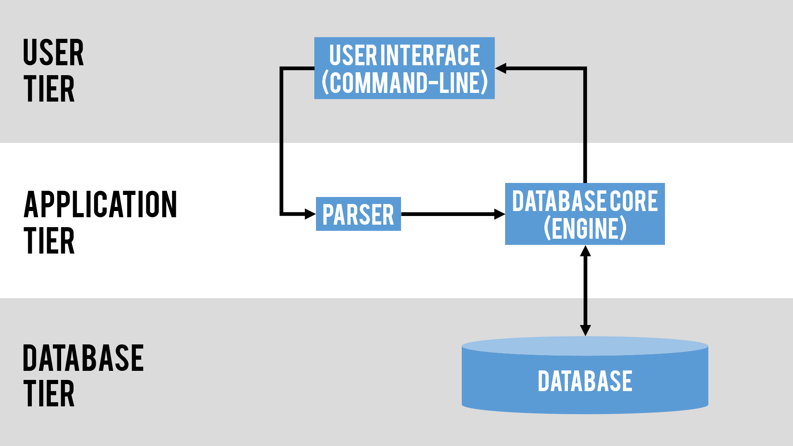

> the four major entities.

#### API (Application). 	

The front end of the application is a command line interface that allows users to create a library of music that includes information about tracks, albums, and artists. Users are able to navigate the app through a menu system and undertake the following actions and more.

* Create Artist: Allows a user to add an artist to the database.
* Create Album: Allows a user to add an album to the database.
* Create Track: Allows a user to add a track to the database.
* Delete Artist: Allows a user to remove an artist from the database.
* Delete Album: Allows a user to remove an album from the database.
* Delete Track: Allows a user to remove a track from the database.
* View Artist Albums: Allows a user to see a list of what albums an artist created.
* View Album Tracklist: Allows a user to see the track listing for an album.
* View Artist Tracks: Allows a user to see a list of tracks that an artist has created.
* View All Albums: Allows a user to see all albums on the database.
* View All Artists: Allows a user to see all artists on the database.
* View All Tracks: Allows a user to see all tracks on the database.
* Search Artist: Allows a user to search for a particular artist.
* Search Album : Allows a user to search for a particular album.
* Search Track: Allows a user to search for a particular track.

The backend of the application takes the actions selected by the user and creates a pseudo-SQL Backus Naur grammar to send to the parser.

#### Parser.

The parser takes the Back Naur commands given via our database application. The commands are checked for validity, interpreted using recursive descent, and then called using the engine. 

#### Database Core (Engine).

The database core, otherwise known as the engine, takes performs the operation called by the parser onto the database. The engine also sends error messages or output to the application.

#### Database.

The database is collection of data structures representing the user's stored data, which the engine operates on.

#### Interaction.

> steps of a user interaction.

## Low-Level Design. 

#### Application.

The application has the appearance of a basic shell. It prompts the user by giving a list of commands to choose from. Each command has a sequence of follow-up prompts to guide the user. The application takes user commands from standard input. It then translates the command into pseudo-SQL. Once the command is in pseudo-SQL format, the application sends the command to the parser.

> to see some samples of our application, please refer to the example sessions at the bottom

Our application stores and manipulate the following:

Entities – each entity is represented by a generic relation class holding relevant data.
* Artist(Artist Name, Debut Year)
* Album(Album Name, Release Year)
* Tracks(Track Name, Release Year, Track Length, Genre)

Relationships – each relation is a table holding entities that are related.
* Created(Album → Artist)
* IsOn(Tracks → Album)

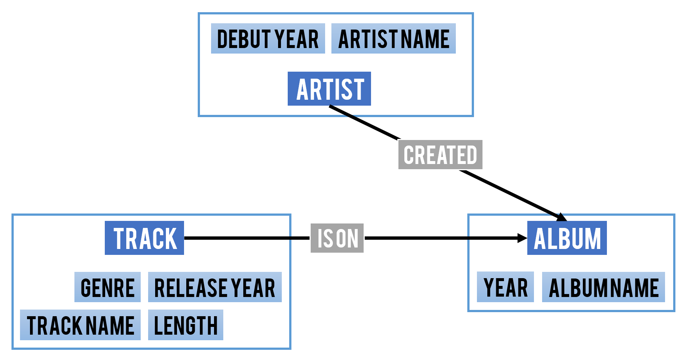

> all entities and relations.

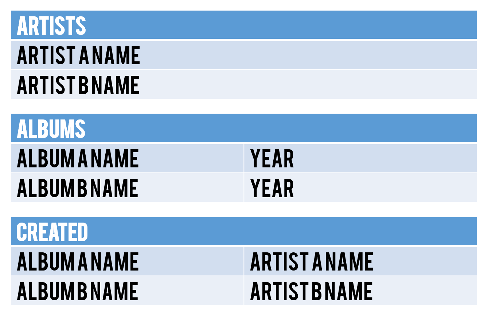

> some example tables.

There are 5 tables total; one for each entity and one for each relation.

#### Parser.

The parser analyzes commands by identifying statements as commands, queries, atomic expressions, expressions, and so on. Some identifiers is expressed as combinations of other identifiers, eventually ending in a terminal statement or symbol. The parser recursively calls back each portion of the command until complete.

#### Database Core (Engine).

The engine is a collection of functions that operates on the database. The engine has the ability to manipulate data in the following ways:

* Insert, update, and delete rows.
* Create and drop tables.
* Projection, selection, renaming, union, difference, (cross) product, and natural join.

Additionally, the engine has the ability to save and load data to and from a disk file in a text-based format.

#### Database.

The database uses hash tables to store relations. The data in is stored in a generic tuple class. Originally each entry is identified by an ID value that is an integer, however, it became difficult to keep track of the individual ID numbers when incorporating the parser. Instead of using ID values as identifiers, we went with using the names of each entry as its identifier . In tracks, we added the attributes release year, track length, genre while we added the attributes debut year to Artist and release year to Album.

## Benefits, Assumptions, Risks/Issues.

#### Benefits.

* The application, when used with a database, allows a user to manage a database relating to music.
* The use of Hash Maps in the database provides for quick access of data.
* The database engine is ambiguous, using separated levels, therefore it is flexible for use in other fields. Thus, another application can be written to manage databases for other purposes.
* The command line user interface allows for users to easily manipulate data even without knowledge of technical syntax. (The user is able to choose from a list of options and which the API then translates into syntax that the database understands.)
* The design allows for easy forward and reverse tracking between data members. (Ex. the user can find a song by looking through artists and then albums then tracks. the user can also find an artist by looking at the track and then the album then the artist.)
* The use of Java to write our database components allows for portability.

#### Assumptions.

* It is assumed that the user is able to compile and run the program.
* It is assumed that the user is competent enough to use a command-line interface.
* It is assumed that all ID numbers (Artist, Album, and Track) are unique within the database.
* It is assumed that the application generates valid commands to send to the parser for parsing.
* It is assumed that the data does not require high levels of security.

#### Risks & Issues.

* The parser needs a reserved namespace for certain words or phrases used to ensure variable names do not get mixed with function calls.
* The parser may end up not being "generic enough" (to be used with other applications) since we are writing it with a particular application in mind.

## Conclusion.

The RDBMS we are built allows users to store and manipulate data. Our application uses our generic database to handle information regarding music such as artist, album, and track while also allowing them to search through the data in an efficient and easy manner. These functions are created by implementing relational algebra in the database. The entire project is composed of four parts, the user interface application, a generic parser, a database core engine, and a database. 

The main benefit of our RDBMS is flexibility. The components of our RDBMS are separate and generic, allowing it to manage similar databases for other purposes. Additionally, the user interface allows those who are unfamiliar with technical syntax to easily use the system. The largest issue addressed is barring input that can be mistaken for function calls. Another foreseen issue is the possibility that the parser for our RDBMS may be incompatible with other applications as the RDBMS was written with a music database application in mind. 

Our RDBMS is practical because it can be used for a variety of applications due to its generic implementation. Thus, it eliminates the need to write multiple databases for different kinds of data. Our application can be highly useful and beneficial to a large scope of users ranging from individual music listeners to music companies as it provides a simple and organized way to access an assortment of information pertaining to different attributes of music. 

## Post Production Notes.

In general, our final product was identical to what we had designed in mind during the preliminary stages. The functionalities and layout we had presented for the application and engine in the design phase were maintained throughout the duration of the project. The parser, however, is where we encountered difficulties. The select, update, and delete functions are not implemented in a way that allows for multiple conditions. There is not enough time to rewrite the engine to include the ability to support multiple condition functionality. We also needed to modify our rename method to keep the original table while renaming the attributes on a copy.

The lessons learned from our issues include the importance of reviewing the specs regularly, regular testing of functions as well as  variety of test cases that address all possible situations. The issues we encountered could have been prevented by looking carefully at the project specs as well as testing early and testing well.

## Example Session(s).

When the user opens the program, the first menu will welcome the user and prompt them to either start a new database or load a previous one. The main menu has a variety of options to aide the user in managing the music library, viewing the libraries, search for entities, save changes made to the database, and exiting the program.

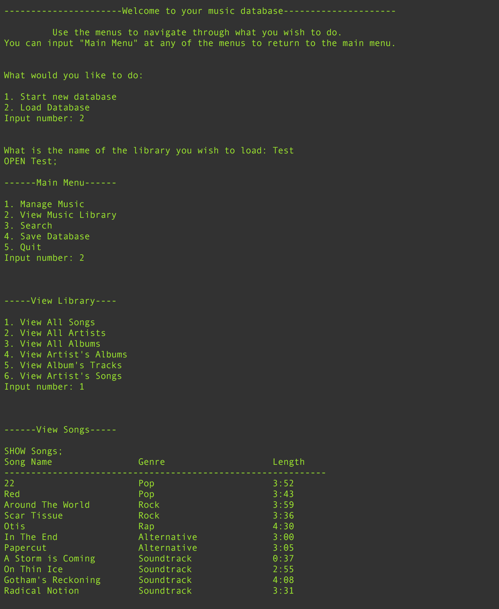

> opening menu, load a database, and view songs

The add menus prompt will ask the user to enter information about the entity to add. 

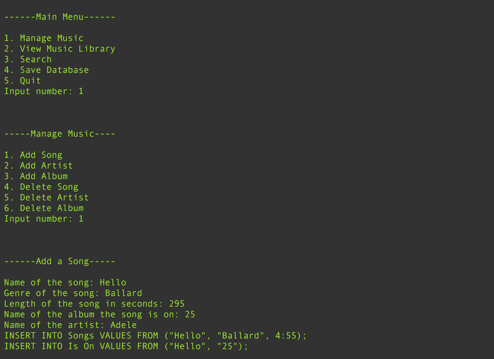

> manage music, add a song.

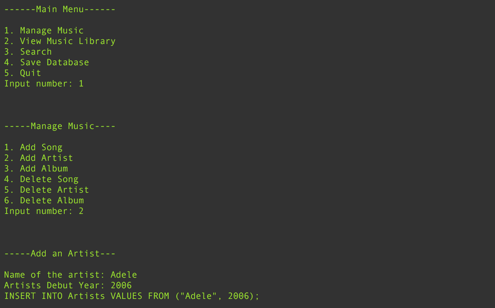

> manage music, add an artist.

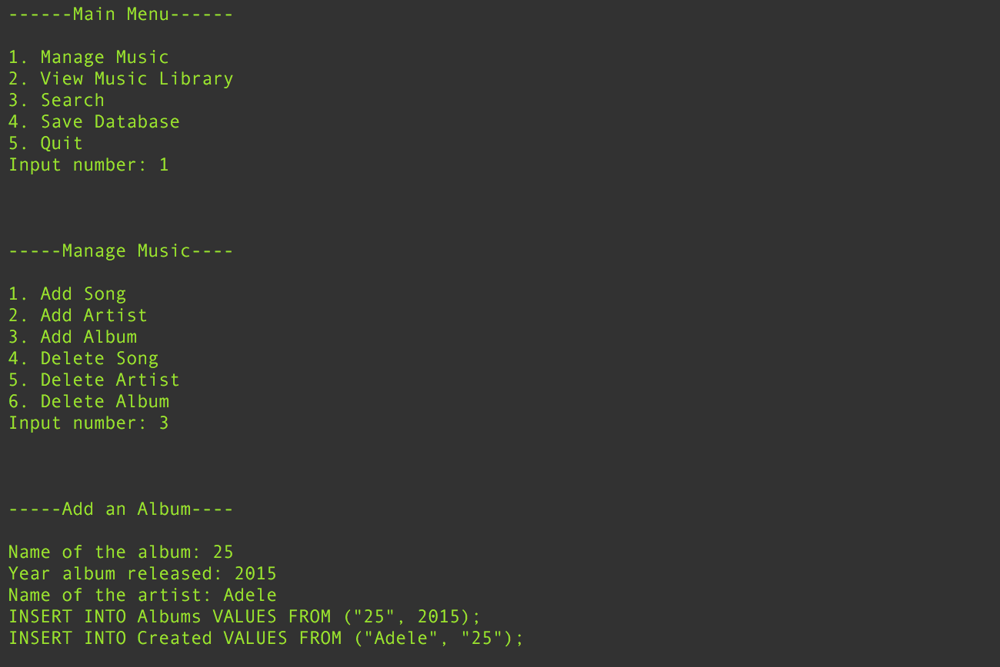

> manage music, add an artist.

The user can also view their whole database, organized by song, album, or artist.

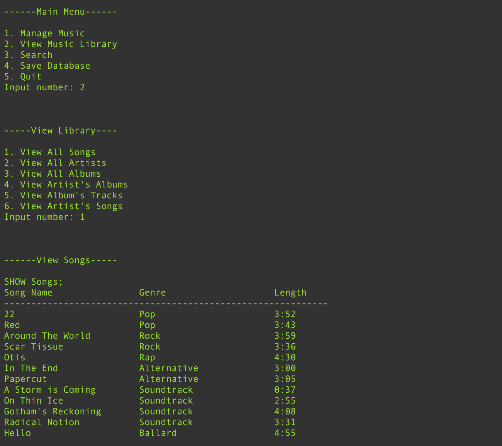

> view all songs

Songs, albums, and artists can be found through their relationships.

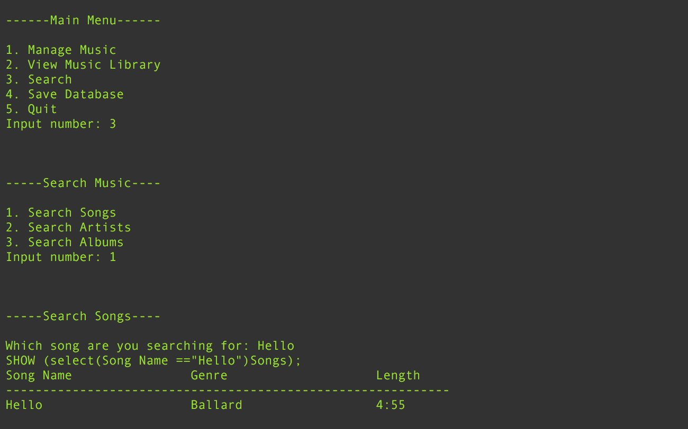

> search for a particular song

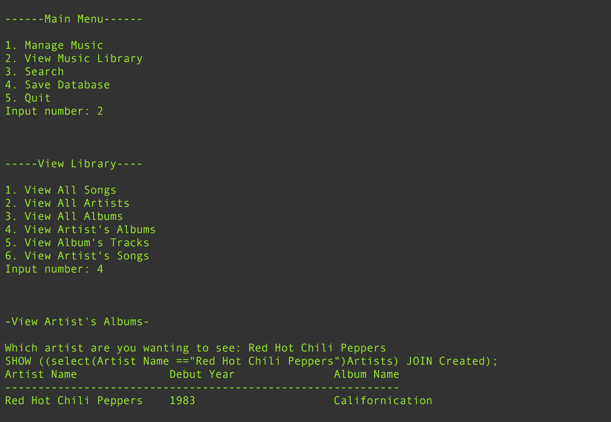

> search for albums by a particular artist

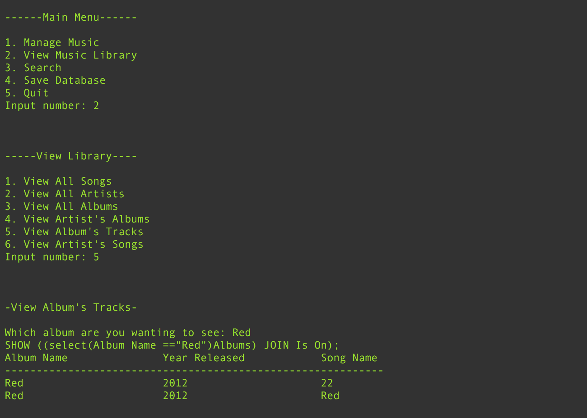

> search for tracks on a particular album

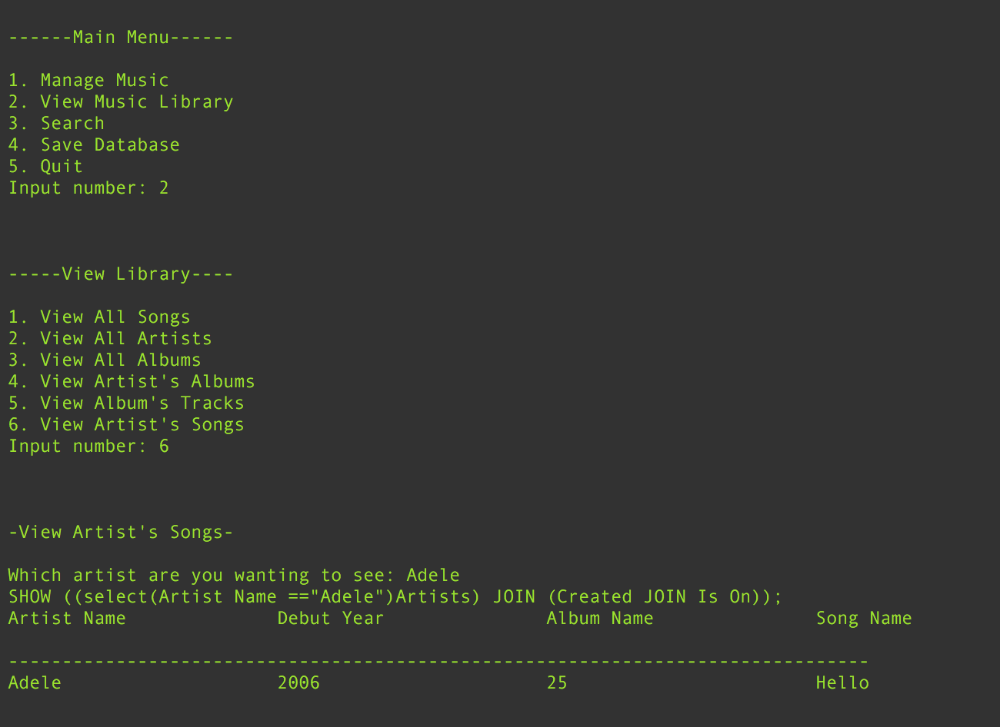

> search for songs by a particular artist

Database stores data from commands permanently for future use.

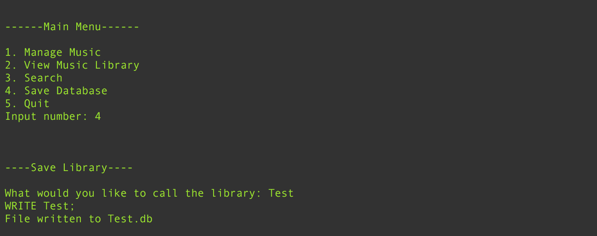

> save

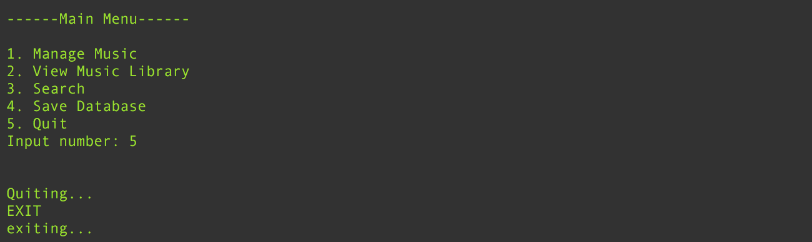

> exit